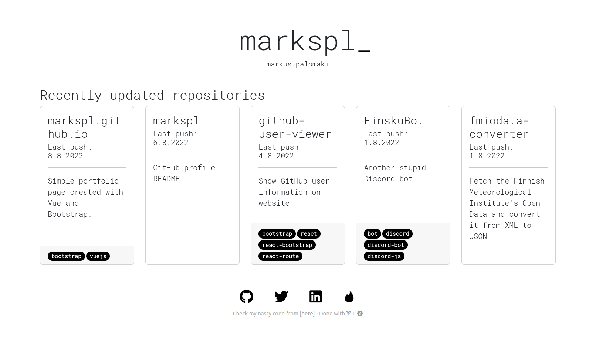

 

 

#### *Simple portfolio created with [Vue](https://vuejs.org/) + [Bootstrap](https://getbootstrap.com/).*

https://markspl.github.io

## How-to
- Install `npm install`
- Compile for dev `npm run serve`
- Compile for prod `npm run build`
- Lintting files `npm run lint`
